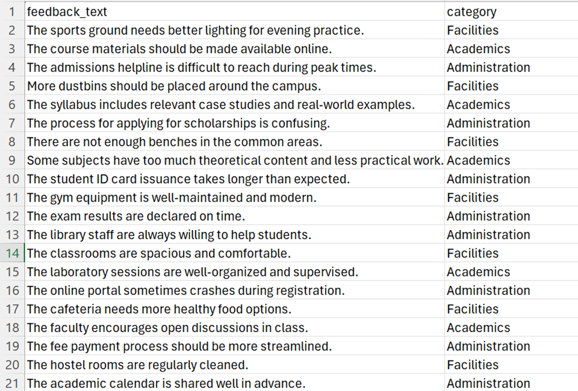
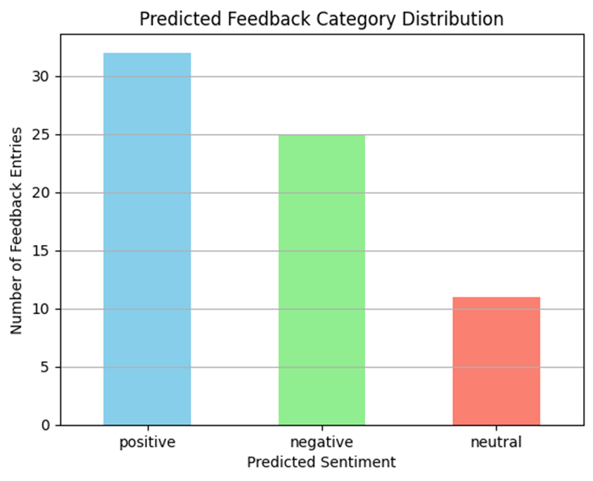
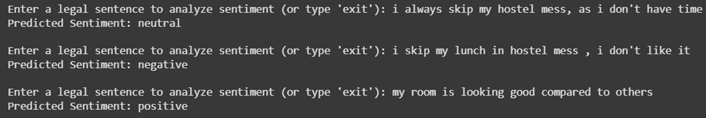

# 🎓 College Feedback Classifier using IBM Watsonx.ai

## 🗺️ Project Flow


*The above flowchart illustrates the end-to-end pipeline of the College Feedback Classifier, from data ingestion to analytics and reporting.*

---

## 🎬 Interactive Demo

[](https://youtu.be/GmCYQmvmWFU)

*Click the image above to watch a walkthrough of the classifier in action, demonstrating real-time feedback categorization and analytics.*

---

## 📂 Dataset Format



*Sample structure of the input dataset. Each row contains open-ended student feedback and its corresponding category.*

---

## 🏁 Sample Output



*Example of the classifier’s output, showing predicted categories for each feedback entry and visual analytics.*

---

## 📌 Project Overview

The **College Feedback Classifier** is an AI-powered system designed to categorize open-ended student feedback into structured categories such as **Academics**, **Facilities**, and **Administration**. By using IBM Watsonx foundation models and prompt engineering, this project enables educational institutions to extract actionable insights and improve student satisfaction across various departments.

---

## 🎯 Objectives

- Automatically classify student feedback using large language models.
- Organize feedback into meaningful themes: Academics, Facilities, Administration.
- Generate department-wise insights for decision-makers.
- Leverage IBM Watsonx Foundation Models with few-shot prompting.

---

## 🛠️ Tools & Technologies

| Component            | Technology                          |
|----------------------|--------------------------------------|
| Programming Language | Python                              |
| AI Model             | IBM Watsonx Foundation Model (FLAN-T5 / Mistral) |
| Cloud Platform       | IBM Cloud                           |
| Data Format          | CSV                                 |
| Prompting            | Few-shot Prompt Engineering         |
| Libraries            | `pandas`, `sklearn`, `ibm_watson_machine_learning` |
| IDEs                 | Google Colab / Jupyter Notebook     |

---

## 📂 Dataset Format

**CSV File Name:** `student_feedback.csv`

| feedback_text                                                              | category       |
|-----------------------------------------------------------------------------|----------------|
| The sports ground needs better lighting for evening practice.             | Facilities     |
| The course materials should be made available online.                      | Academics      |
| The admissions helpline is difficult to reach during peak times.          | Administration |
| ...                                                                         | ...            |

- Total entries: 180+
- Categories: `Academics`, `Facilities`, `Administration`

---

## 🧠 IBM Foundation Models Used

- **Model Options:**
  - `FLAN_T5_XL`
- **Approach:**
  - Few-shot prompting with ~3 labeled examples per category
  - Zero-shot fallbacks for short feedback

---

## 🧪 Prompt Template (Few-Shot)

```
Categorize the following student feedback into one of the following:
Academics, Facilities, or Administration.

Example 1: "The syllabus includes real-world examples." → Academics  
Example 2: "The hostel bathrooms are rarely cleaned." → Facilities  
Example 3: "The admin office takes too long to process forms." → Administration

Feedback: "{feedback_text}"  
Category:
```

---

## 🧱 Implementation Pipeline

### 1. **Data Preparation**

* Load `student_feedback.csv`
* Preprocess and remove empty rows

### 2. **IBM Watsonx.ai Setup**

* Authenticate using API key and project ID
* Select and initialize the foundation model

### 3. **Prompt-Based Classification**

* For each feedback entry:
  * Insert it into the prompt template
  * Send prompt to model
  * Extract predicted category

### 4. **Result Structuring**

* Save outputs to a new CSV: `classified_feedback.csv`
* Optionally evaluate with labeled data (if available)

### 5. **Analytics & Reporting**

* Generate:
  * Category distribution pie chart
  * Frequent word clouds per category
  * Department-wise counts

---

## 🚀 How to Run

### ✅ Prerequisites

* IBM Cloud account with Watsonx access
* IBM Cloud Object Storage (optional for remote data)
* Python 3.8+ and `pip` installed

### 🔧 Installation

```bash
pip install pandas scikit-learn ibm-watson-machine-learning
```

### ▶️ Execution

Run the Jupyter Notebook (or Python script):

```bash
python classify_feedback.py
```

Or on Google Colab:

1. Upload `student_feedback.csv`
2. Run notebook cells (authentication → model → classification)
3. Download output CSV

---

## 📊 Output

**Output File:** `classified_feedback.csv`

| feedback_text                                           | predicted_category |
| -------------------------------------------------------- | ------------------- |
| The cafeteria is overcrowded during lunch hours.         | Facilities          |
| The faculty encourages interactive discussions in class. | Academics           |
| The admin office lost my scholarship form.               | Administration      |

---



## 📈 Future Improvements

* Add more fine-grained categories (e.g., Hostel, Canteen, Library)
* Use multilingual models for regional feedback
* Build a web dashboard for real-time feedback visualization
* Integrate with college portals for direct feedback intake

---

## 🤝 Contributors

* **Project Lead:** Bonala Shanmukesh
* **Co-Creators:** IBM Watsonx Foundation Model Team
* **Data Design & Prompt Engineering:** You & GPT Collaboration

---

## 🧠 Learn More

* [IBM Watsonx.ai Documentation](https://www.ibm.com/cloud/watsonx)
* [Few-Shot Prompting Techniques](https://arxiv.org/abs/2005.14165)
* [FLAN-T5: Scaling Instruction-Finetuned Language Models](https://arxiv.org/abs/2210.11416)

---

## 📄 License

This project is open-source under the **MIT License**. You may use, modify, and share freely with attribution.
